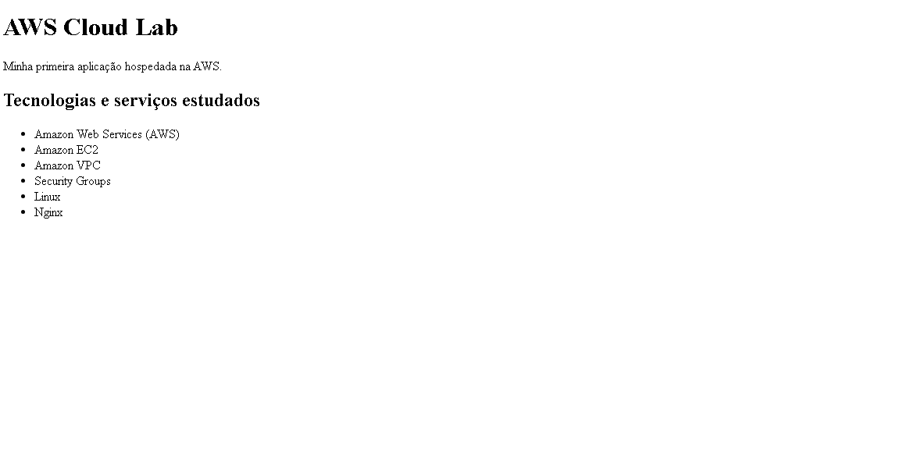
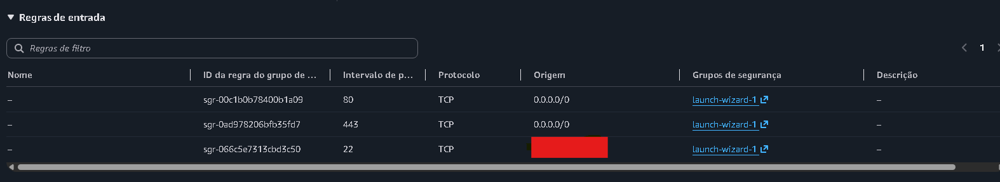
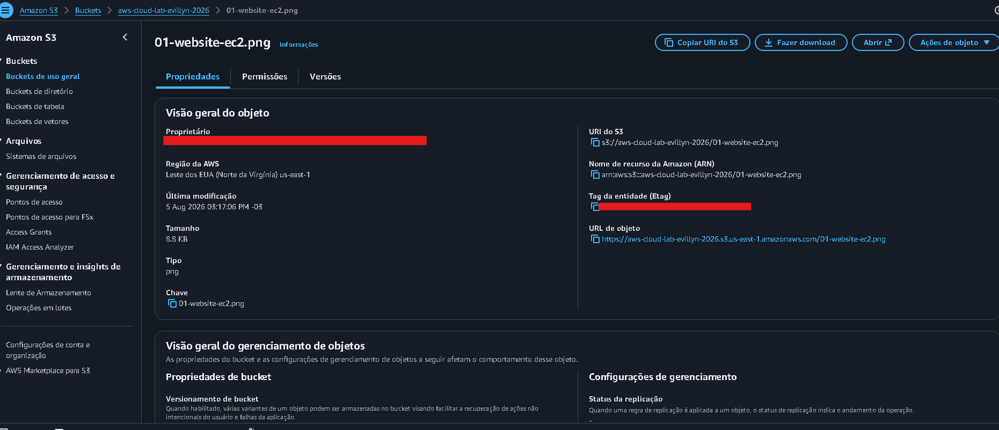

# AWS Cloud Lab

Laboratório prático desenvolvido para aplicar conceitos fundamentais de Amazon Web Services (AWS).

## Objetivo

Construir e documentar uma infraestrutura simples na AWS, realizando o deploy de uma aplicação web e praticando conceitos de computação em nuvem, redes, segurança e armazenamento.

## Tecnologias e serviços

- Amazon Web Services (AWS)
- Amazon EC2
- Amazon S3
- Amazon VPC
- Security Groups
- Ubuntu Linux
- Nginx
- SSH
- Git
- GitHub

## Arquitetura

Internet  
↓  
Security Group  
↓  
Amazon EC2  
↓  
Ubuntu Linux  
↓  
Nginx  
↓  
Aplicação Web

Além da aplicação hospedada na EC2, o Amazon S3 é utilizado para armazenamento de objetos.

## Resultado

A aplicação web foi implantada em uma instância Amazon EC2 e disponibilizada via HTTP utilizando Nginx.

## Documentação

A documentação detalhada da arquitetura e das configurações utilizadas está disponível em:

`docs/architecture.md`

## Segurança

- Acesso SSH restrito ao IP autorizado.
- Chaves privadas `.pem` não são versionadas.
- Bucket S3 com acesso público bloqueado.
- Credenciais e variáveis de ambiente são ignoradas pelo Git.

### Security Group

O acesso à instância EC2 é controlado por um Security Group.

- HTTP (porta 80) liberado para acesso à aplicação web.
- SSH (porta 22) restrito ao IP autorizado.

### Amazon S3

O Amazon S3 foi utilizado para praticar armazenamento de objetos na nuvem.

O bucket foi configurado com bloqueio de acesso público e criptografia padrão SSE-S3.

